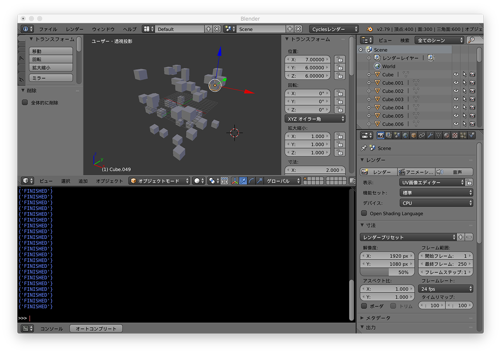
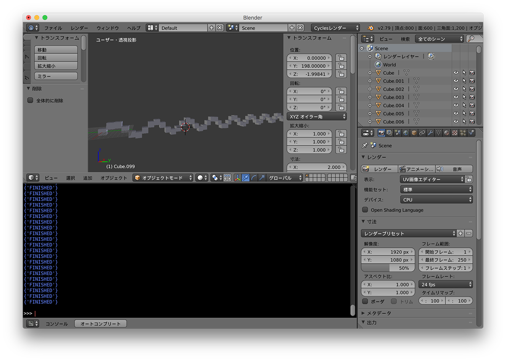
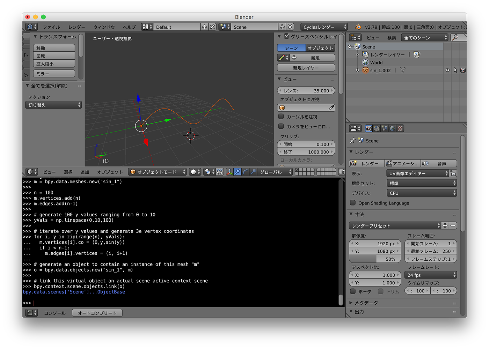
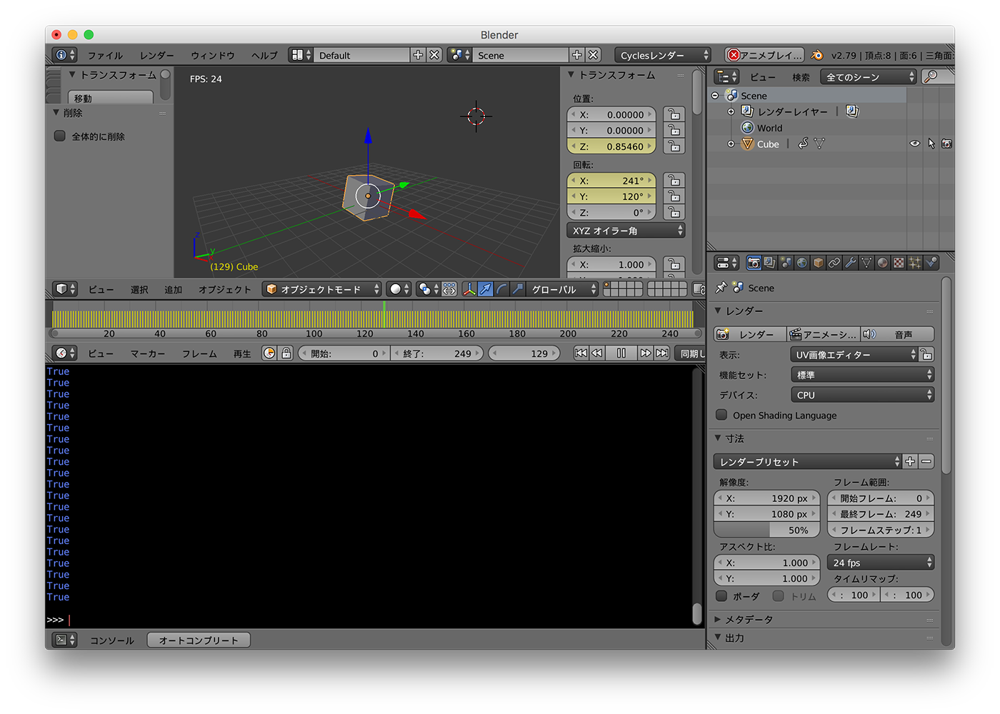

# Creating-Awesome3D-With-Python  


180902  

[https://www.youtube.com/watch?v=GiCcK039x_o](https://www.youtube.com/watch?v=GiCcK039x_o)

source code ↓  
[https://github.com/Tlousky/blender_scripts/tree/master/pycon2016il](https://github.com/Tlousky/blender_scripts/tree/master/pycon2016il)


---  


### what's bpy  

blender python API  
bpy module  

additional module  
- bmesh  
- bge // game engine  
- bgl // opengl  
- blf // font  
- mathutils  


---  

### Sample Scripts  


### random  

```python
import bpy
from random import randint

# generate 50 cubes in random location
for i in range(50):
  bpy.ops.mesh.primitive_cube_add(
    location = [randint(-10,10) for axis in "xyz"]
  )

```
  


---  


### Array with Sine Curve  

```python
import bpy
from math import sin

# generate 100 cubes along a sine curve  
for i in range(100):
  x,y,z = 0,i*2,sin(i)*2
  bpy.ops.mesh.primitive_cube_add(
    location = [x,y,z]
  )

```
  


---  


### Generate a polygonal mesh with numpy  

```python
import bpy
import numpy as np

from math import sin

def linspace(start, end, n):
  step = (end - start)/n
  return [start+ i*step for i in range(n)]

# generate new mesh
m = bpy.data.meshes.new("sin_1")

n = 100
m.vertices.add(n)
m.edges.add(n-1)

# generate 100 y values ranging from 0 to 10
yVals = np.linspace(0,10,100)

# iterate over y values and generate 3e vertex coordinates
for i, y in zip(range(n), yVals):
  m.vertices[i].co = (0,y,sin(y))
  if i < n-1:
    m.edges[i].vertices = (i, i+1)

# generate an object to contain an instance of this mesh "m"
o = bpy.data.objects.new("sin_1", m)

# link this virtual object an actual scene active context scene
bpy.context.scene.objects.link(o)

```

  


---  


### Animation  

[https://github.com/Tlousky/blender_scripts/blob/master/pycon2016il/csv2blender_animated.py](https://github.com/Tlousky/blender_scripts/blob/master/pycon2016il/csv2blender_animated.py)


```python
import bpy  
from math import sin

# Add cube (box) object
bpy.ops.mesh.primitive_cube_add(location=(0,0,0))

for i in range(250):
  cube = bpy.data.objects[bpy.context.object.name]
  cube.location.z = sin(i*0.1)
  cube.rotation_euler.x = i*0.05
  cube.rotation_euler.y = i*0.025
  bpy.context.scene.update()
  cube.keyframe_insert(data_path = 'location', index = 2, frame = i) # index : 0=x, 1=y, 2=z
  cube.keyframe_insert(data_path = "rotation_euler", index=0, frame=i)
  cube.keyframe_insert(data_path = "rotation_euler", index=1, frame=i)

```

  


