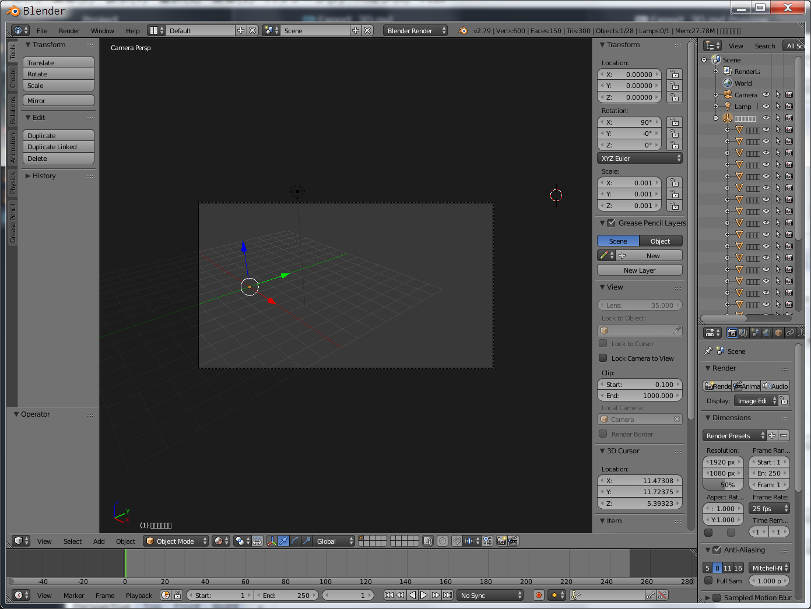
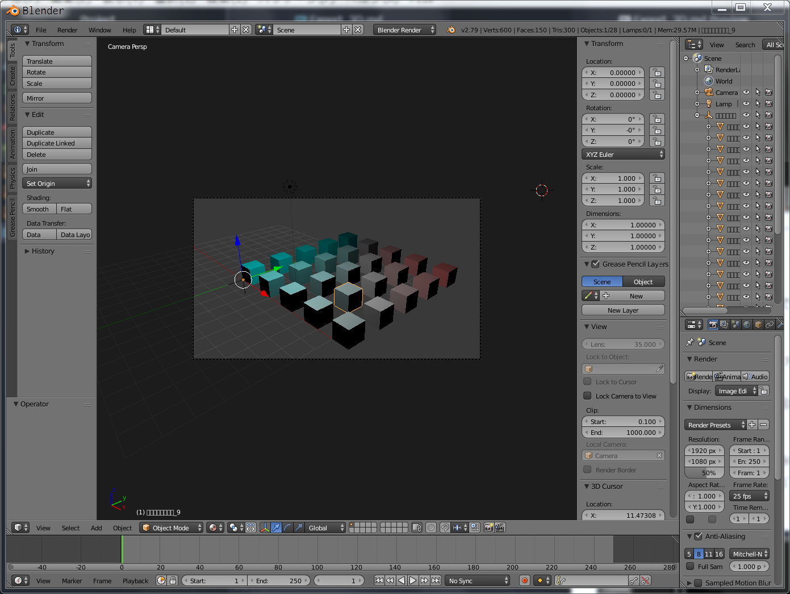
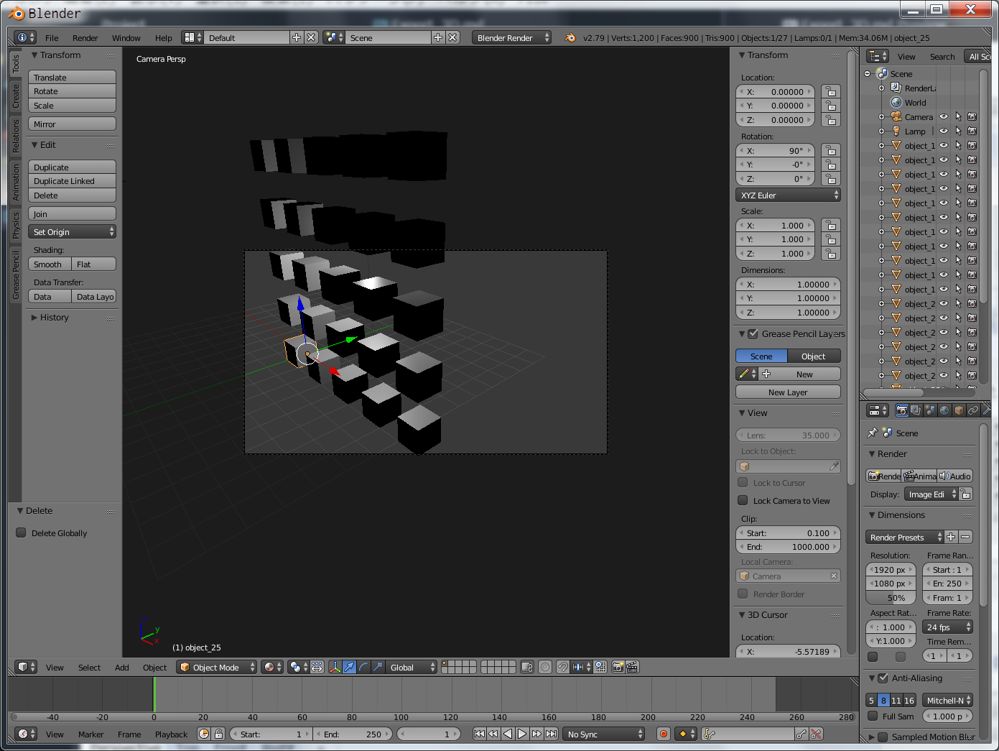

# Import_3D  

想定出来るファイルフォーマットはこのへん。  

- DAE // material
- FBX // material
- OBJ
- STL

マテリアル（色）を持ってこれるのが、DAE / DAE なので、色つきならどっちか。  

csv とかに情報を逃がしておいて or Blender 側で計算して、それでもいいので、そのときは、OBJ も有り。  

---  

### FBX  

現状これが一番良い（特に問題なし）。  

Blender では、FBX 読み込み時の設定で、角度とスケールがプリセットされているが、0度 / 1倍 に修正すれば、ok。  
  

修正後  
  

---  

### OBJ  

色情報は、MAT ファイルが必要。  

複数オブジェクトを、1つのファイルで書き出しても、問題ない。  
それぞれのオブジェクトに名前が振られている。  
  

---  

### STL

色、不可。  

複数オブジェクトを、1つのファイルで書き出すと、位置関係の変更不可。  

3D プリント以外の用途はおそらく無し。  

---  