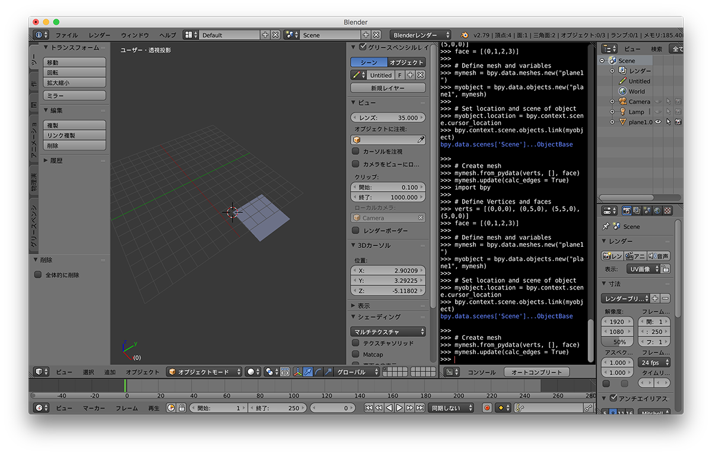
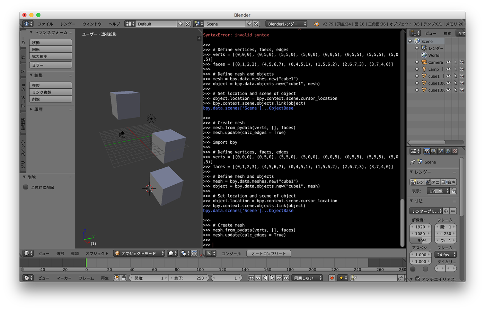
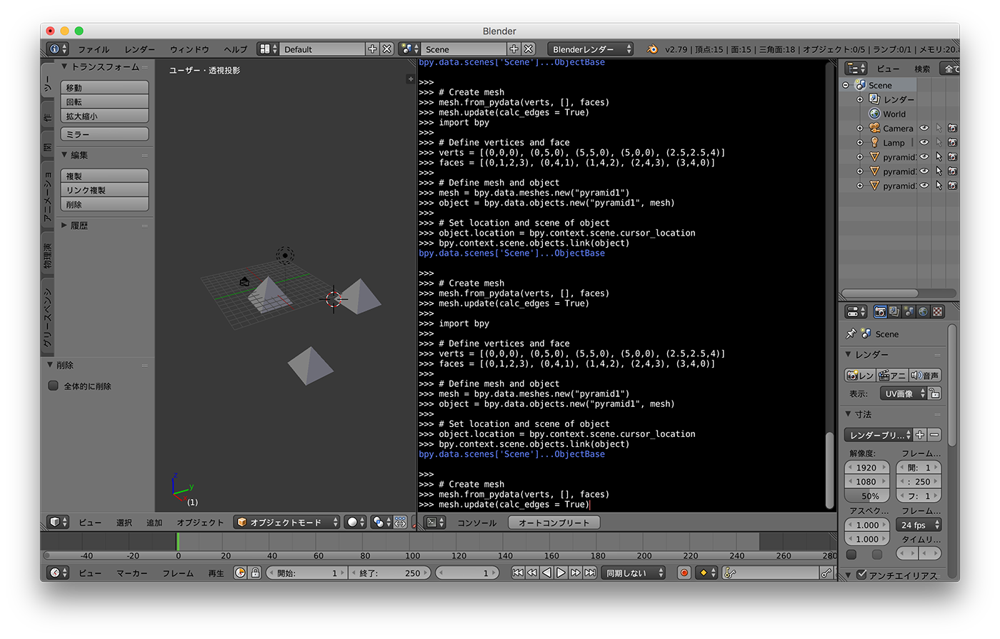
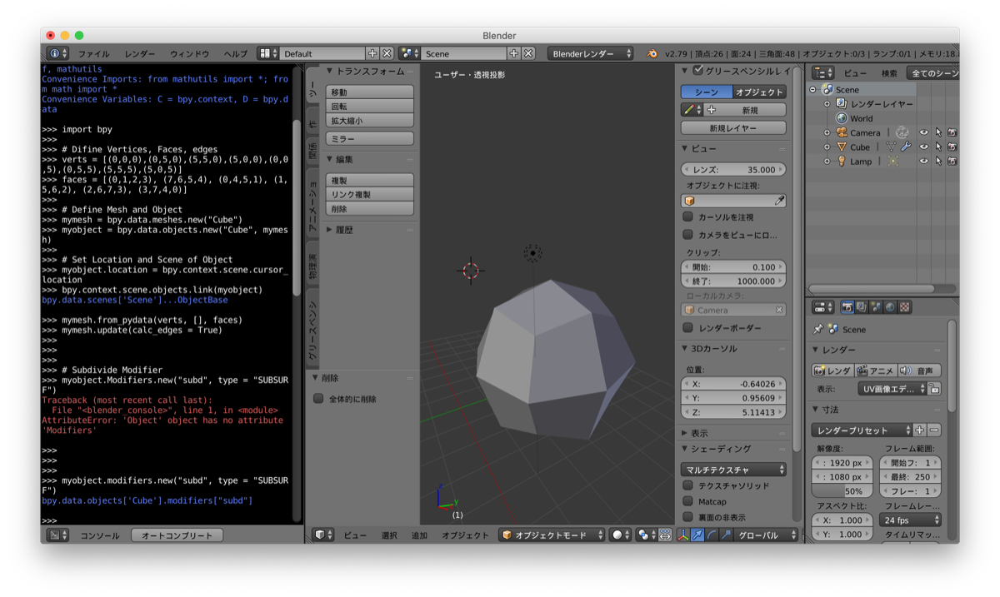
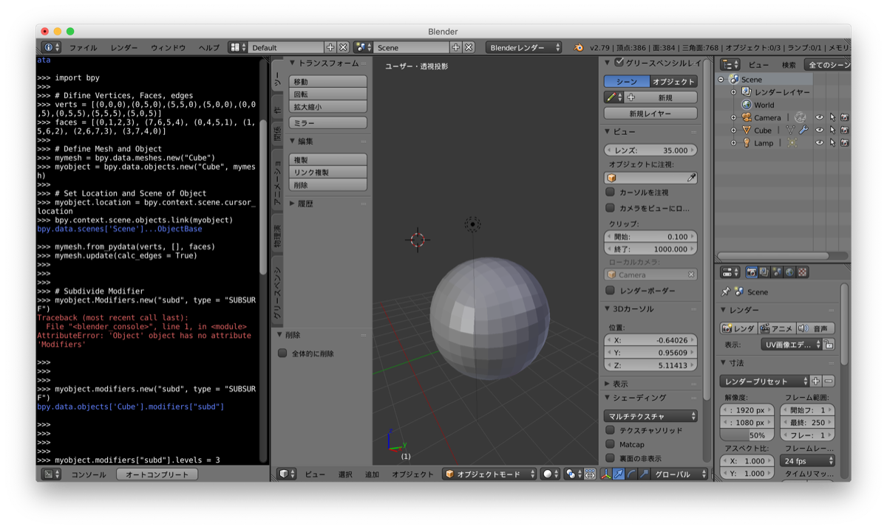
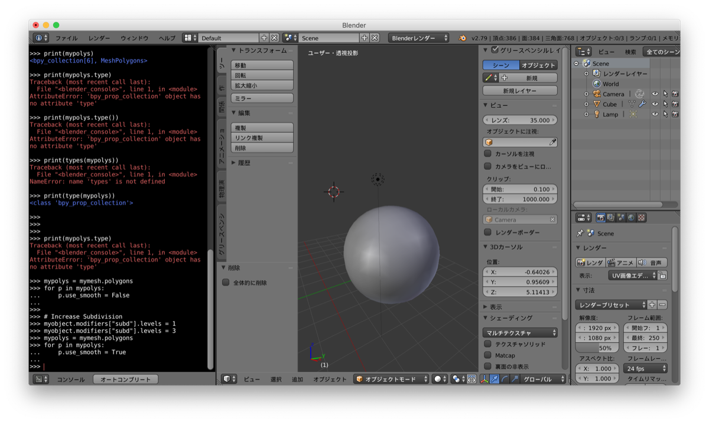
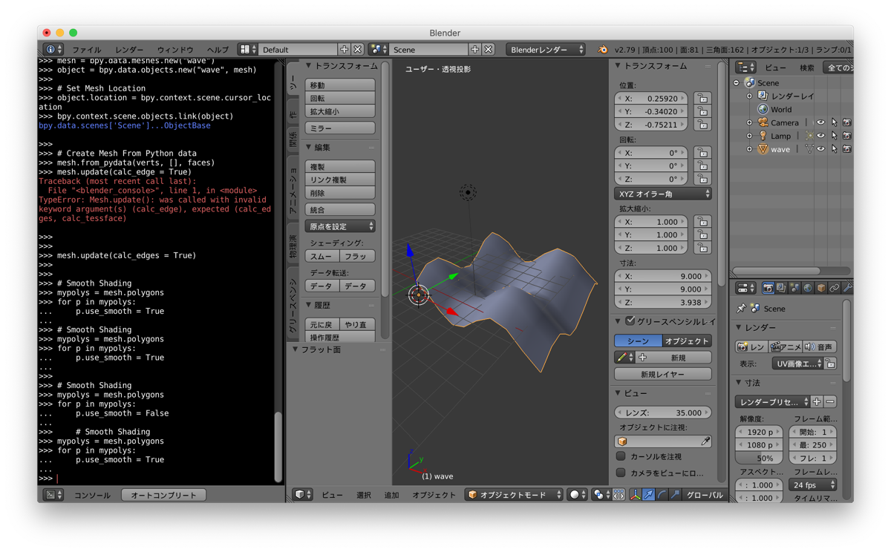

# Nathan's Blender Python Notebook  

180909 -  

[http://wiki.theprovingground.org/blender-python](http://wiki.theprovingground.org/blender-python)  


---


### Index  

- [x] Environment  
- [x] SetUp  
- [ ] ~~Meshes~~  
- [x] MeshDefinition  
- [x] Modifiers  
- [x] MathematicalMesh  
- [ ] RandomMesh  
- [ ] Supershape3D  


---  

---  


### Environment  

x  


---  


### SetUp  

// 諸設定  


Import Libraries  
```python
import bpy # Blender Python API
import mathutils # Blender vector math utilities
import math # standard Python math library
```

Print  
```python
hello = "Hello World.\nHello bpy."
print(hello)

```

Create Cube  
```python
import bpy

bpy.ops.mesh.primitive_cube_add(location = (1,2,3))

x1 = 2
y1 = 3
z1 = 4
bpy.ops.mesh.primitive_cube_add(location = (x1,y1,z1))

```

for Loop  
```python
for m in range(0,10):
    x2 = 3*m
    y2 = 0
    z2 = 0
    bpy.ops.mesh.primitive_cube_add(location=(x2,y2,z2))


for i in range(0,10):
    for j in range(0,10):
        x3 = 3*i
        y3 = 3*j
        z3 = 0
        bpy.ops.mesh.primitive_cube_add(location=(x3,y3,z3))


for i in range(0, 10):
    for j in range(0, 10):
        x4 = i*3
        y4 = j*3
        z4 = 0
        bpy.ops.mesh.primitive_monkey_add(location=(x4,y4,z4))
```


---  


### ~~Meshes~~  


---  


### MeshDefinition  

// メッシュを構築する  


複数の頂点情報から、ポリメッシュを構築する。  

4つの頂点から、Plane を作成する   
```python
import bpy

# Define Vertices and faces
verts = [(0,0,0), (0,5,0), (5,5,0), (5,0,0)]
face = [(0,1,2,3)]

# Define mesh and variables
mymesh = bpy.data.meshes.new("plane1")
myobject = bpy.data.objects.new("plane1", mymesh)

# Set location and scene of object
myobject.location = bpy.context.scene.cursor_location
bpy.context.scene.objects.link(myobject)

# Create mesh
mymesh.from_pydata(verts, [], face)
mymesh.update(calc_edges = True)

```
  


8つの頂点から、Cube を作成する  
```python
import bpy

# Define vertices, faecs, edges
verts = [(0,0,0), (0,5,0), (5,5,0), (5,0,0), (0,0,5), (0,5,5), (5,5,5), (5,0,5)]
faces = [(0,1,2,3), (4,5,6,7), (0,4,5,1), (1,5,6,2), (2,6,7,3), (3,7,4,0)]

# Define mesh and objects
mesh = bpy.data.meshes.new("cube1")
object = bpy.data.objects.new("cube1", mesh)

# Set location and scene of object
object.location = bpy.context.scene.cursor_location
bpy.context.scene.objects.link(object)

# Create mesh
mesh.from_pydata(verts, [], faces)
mesh.update(calc_edges = True)
```
  


5つの頂点から、Pyramid を作成する  
```python
import bpy

# Define vertices and face
verts = [(0,0,0), (0,5,0), (5,5,0), (5,0,0), (2.5,2.5,4)]
faces = [(0,1,2,3), (0,4,1), (1,4,2), (2,4,3), (3,4,0)]

# Define mesh and object
mesh = bpy.data.meshes.new("pyramid1")
object = bpy.data.objects.new("pyramid1", mesh)

# Set location and scene of object
object.location = bpy.context.scene.cursor_location
bpy.context.scene.objects.link(object)

# Create mesh
mesh.from_pydata(verts, [], faces)
mesh.update(calc_edges = True)

```
  


---  


### Modifiers  

// モディファイアーを操作する  


Subdivision Modifier  

```python
import bpy

# Difine Vertices, Faces, edges
verts = [(0,0,0),(0,5,0),(5,5,0),(5,0,0),(0,0,5),(0,5,5),(5,5,5),(5,0,5)]
faces = [(0,1,2,3), (7,6,5,4), (0,4,5,1), (1,5,6,2), (2,6,7,3), (3,7,4,0)]

# Define Mesh and Object
mymesh = bpy.data.meshes.new("Cube")
myobject = bpy.data.objects.new("Cube", mymesh)

# Set Location and Scene of Object
myobject.location = bpy.context.scene.cursor_location
bpy.context.scene.objects.link(myobject)

# Create meshes
mymesh.from_pydata(verts, [], faces)
mymesh.update(calc_edges = True)

# Subdivide Modifier
myobject.modifiers.new("subd", type = "SUBSURF")

# Increase Subdivision
myobject.modifiers["subd"].levels = 3

# Smooth Shading
mypolys = mymesh.polygons
for p in mypolys:
    p.use_smooth = True

```

  

  

  


---  


### MathematicalMesh  

// 数式を使ってジオメトリを作る  


wave surface  

```python
import bpy
import math


# Variables
verts = []
faces = []

numX = 10
numY = 10

# wave Variables
freq = 1
amp = 1
scale = 1


# Vertices
for i in range(0, numX):
    for j in range(0, numY):
        x = scale * i
        y = scale * j
        z = scale * ((amp*math.cos(i*freq)) + (amp*math.sin(j*freq)))
        vert = (x,y,z)
        verts.append(vert)


# Faces
count = 0

for i in range(0, numY*(numX -1)):
    if count < numX -1:
        A = i
        B = i + 1
        C = (i + numY) + 1
        D = (i + numY)
        face = (A,B,C,D)
        faces.append(face)
        count = count + 1
    else:
        count = 0;


# Create mesh and object
mesh = bpy.data.meshes.new("wave")
object = bpy.data.objects.new("wave", mesh)

# Set Mesh Location
object.location = bpy.context.scene.cursor_location
bpy.context.scene.objects.link(object)

# Create Mesh From Python data
mesh.from_pydata(verts, [], faces)
mesh.update(calc_edges = True)

# Smooth Shading
mypolys = mesh.polygons
for p in mypolys:
    p.use_smooth = True

```

  


---  


### RandomMesh  

// random module を使ったモデリング  


import  
```python
import random
```

```python
```


---  


### Supershape3D  


// parametric geometry  


```python
```

```python
```

---  
