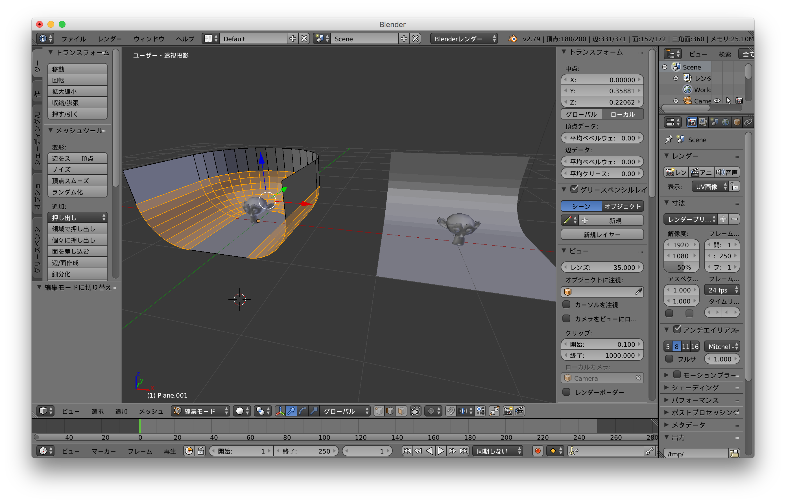
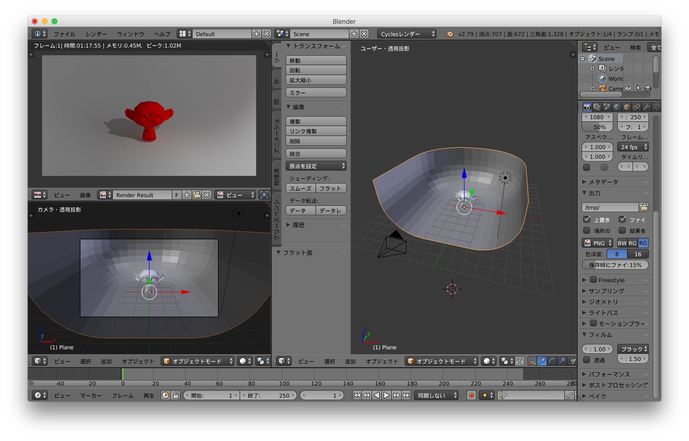

# Study-Blender  

### index  

- Blender-API-Intro.md  
  // 日本語でググって出て来たもの  

- Creating-Awesome3D-With-Python.md  
  // 誰かのpyCon2016 の発表  

- Intro-To-Python-Scripting-In-Blender.md  
  // 適当に送りながら見たけど、なんかのアドオンの紹介してるようにみえたのでやめた  

- Scripting_for_Artist.md  
  // python の チュートリアル  
  // よくわからんところで終わるので良くない  

- Studio  
  // 背景用の板。データ有り。  

Python スクリプティングの資料がほとんどないな...

---  

無料(!)の 3D CG ソフト。  
[https://www.blender.org/](https://www.blender.org/)  

こっちに書いてたけど、うまくまとまらないので、github の方でリンク等まとめたい...  
[http://ysok-na.hatenablog.com/archive/category/blender](http://ysok-na.hatenablog.com/archive/category/blender)  

---  

### ショートカット  

- 全般  
  - fn + del : 削除  
  - テンキー5 : persepective ←→ Orthgraph 切り替え

- オブジェクトモード  
  - W : ブーリアンメニュー  

- 編集モード
  - cntrl + R : （面を選んでから）エッジを挿入  
  - F : 面貼り、ブリッジ  
  - A : メッシュ全体を選択  
  - Cntrl + N : メッシュの面裏を再計算   
  - W : スペシャルメニュー（ベベルなど）  

---  

### 背景として簡易スタジオを作る  

詳しくはこっちに（[Studio.md](https://github.com/naysok/Study-Blender/blob/master/Studio/Studio.md)）  

  
  

---  

### リンク  

- cycles でのノイズ対策（[http://ch.nicovideo.jp/Arasen/blomaga/ar475887](http://ch.nicovideo.jp/Arasen/blomaga/ar475887)）  
  - レンダータブ > サンプリング > 設定 > 間接値を制限 > 1.0  

- 下絵を挿入（[https://blender-cg.net/background-images/](https://blender-cg.net/background-images/)）  

- サーフェスでのモデリング（[http://riotoqll.hatenablog.com/entry/2014/02/10/162604](http://riotoqll.hatenablog.com/entry/2014/02/10/162604)）  

- モデリング練習に使える？模写、猫（[https://www.thingiverse.com/thing:683053](https://www.thingiverse.com/thing:683053)）  