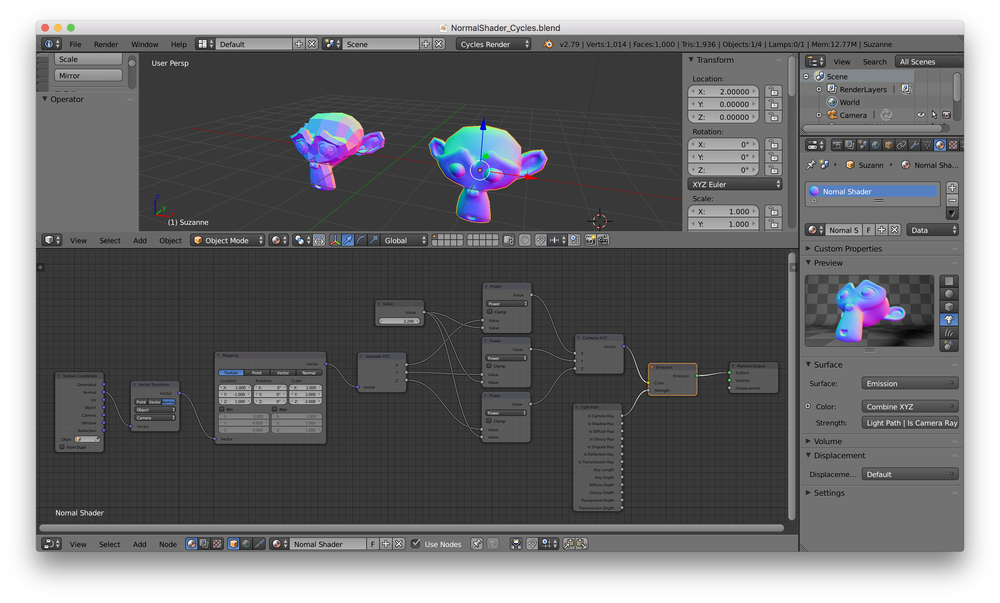

# Shader-Normal-Vector  

  

### Node  

##### Input > Texture Coordinate  
out : Normal [1]  

##### Vector > Vector Transform  
in  : Vector [1]  
out : Vector [2]  
type : Normal  
set 1 : Object  
set 2 : Camera  

##### Vector > Mapping  
in  : Vector [2]  
out : Vector [3]  
type : Texture  
location : (-1, -1, 1)  
rotation : (0, 0, 0)  
scale : (2, 2, -2)  

##### Converter > Separate XYZ  
in  : Vector[3]  
out : X[4], Y[5], Z[6]  

##### Input > Value  
out : Value[7]  
num : 2.2  

##### Converter > Math > Power 1  
in  : Value1[4], Value[7]  
out : Value[8]  

##### Converter > Math > Power 2  
in  : Value1[5], Value[7]  
out : Value[9]  

##### Converter > Math > Power 3  
in  : Value1[6], Value[7]  
out : Value[10]  

##### Converter > Combine XYZ  
in  : Value[8], Value[9], Value[10]  
out : Vector[11]  

##### Input > Light Path  
out  : Is Camera Ray[12]  

##### Shader > Emission  
in  : Color[11], Strength[12]  
out : Emission[13]  

##### Output > Material Output  
in  : Surface[13]  

途中で、なぜか math.pow(x, 2.2) を使う部分がある。なぞ。ただの調整なら良いけど。  

---  

### Ref  

Cycles normal shader with colors similar to baked normals  
[https://blender.stackexchange.com/questions/38234/cycles-normal-shader-with-colors-similar-to-baked-normals](https://blender.stackexchange.com/questions/38234/cycles-normal-shader-with-colors-similar-to-baked-normals)  

---  
