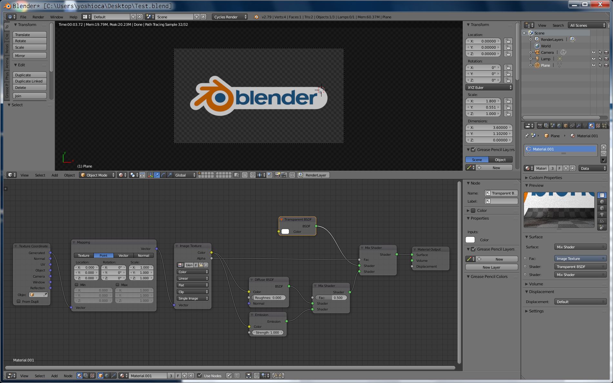
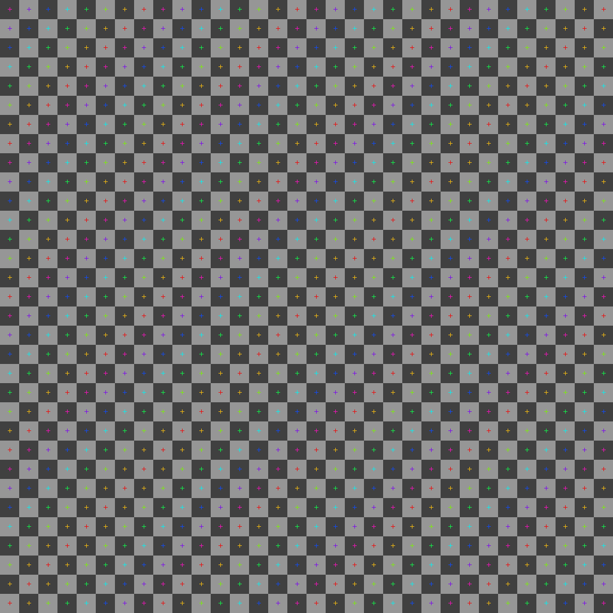

# Texture-Alpha  

  

### Node  

##### Input > Texture Coordinate  
out : Generated[1]  

##### Vector > Maping  
in  : Vector[1]
out : vector[2]

##### Texture > Image Texture  
in  : Vector[2]  
out : Color[3], Alpha[4]  
open : select file  

##### Shader > Diffuse BSDF  
in  : color[3]
out : BSDF[5]

##### Shader > Emission BSDF  
in  : color[3]
out : BSDF[6]

##### Shader > Mix Shader  
in  : Shader[5], Shader[6]
out : Shader[7]

##### Shader > Transparent BSDF  
out : BSDF[8]

##### Shader > Mix Shader  
in  : Shader[7], Shader[8], Fac[4]
out : Shader[9]

##### Output > Material Output  
in  : Surface[9]

テクスチャが見えやすいように、Emission も混ぜる。  

---  

### ref  

Blender Cycles memo / アルファテクスチャマッピング  

[http://cycles.wiki.fc2.com/wiki/%E3%82%A2%E3%83%AB%E3%83%95%E3%82%A1%E3%83%86%E3%82%AF%E3%82%B9%E3%83%81%E3%83%A3%E3%83%9E%E3%83%83%E3%83%94%E3%83%B3%E3%82%B0](http://cycles.wiki.fc2.com/wiki/%E3%82%A2%E3%83%AB%E3%83%95%E3%82%A1%E3%83%86%E3%82%AF%E3%82%B9%E3%83%81%E3%83%A3%E3%83%9E%E3%83%83%E3%83%94%E3%83%B3%E3%82%B0)  

---  

### Calib Image  

UV/Image Editor  

image > new image  

  

  

---  
